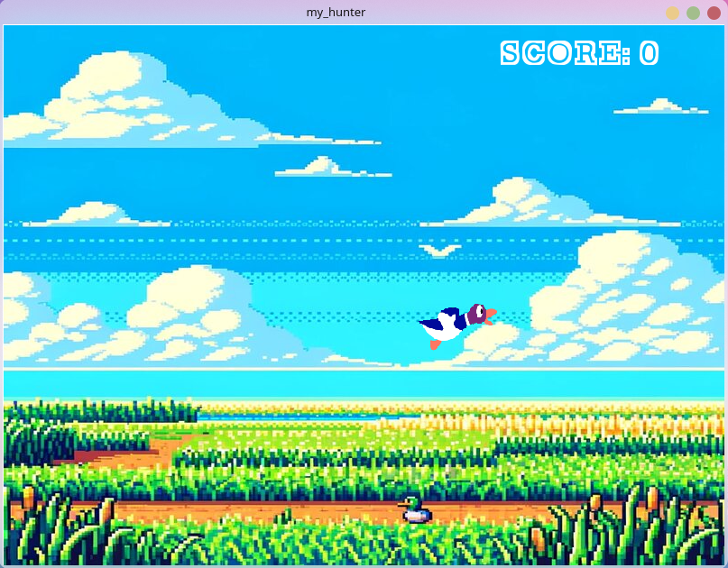

MY_HUNTER

Description : 

Ce projet est un mini-jeux inspiré du jeux japonais "Duck Hunt" consistant à faire passer des cibles en mouvement avec pour but de les toucher !




Installation et Exécution :
  Prérequis
> GCC Compiler
> CSFML Library


Instructions : 


1 > Clonez le répertoire

```git clone git@github.com:Yasl290/my_hunter.git```


2 > Compilez le Projet


```make```

3 > Exécutez le Simulateur

```./my_hunter```

ENJOY !
